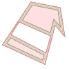
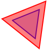

Generating Areas
====
After CuraEngine has created cross sections of your model, it will subdivide each layer into zones that it designates to be filled with material to serve a certain purpose. The most significant of these "features" are infill, skin, walls and support. The input of this slicing stage is a set of layers, and the output is a bunch of polygons for each of those layers. Those polygons are grouped by feature: Whether they must be filled with infill, skin, etc.

Separating Out the Walls
----
The first step in separating a layer into areas is to separate out the parts that are going to become walls.

To this end, a number of insets are produced from the original layer shape, one for each wall. In the image below, three walls are generated. One is for the outer wall (coloured in red), and the other two for the inner walls (in green).

The first inset (drawn in red) is generated for the outer wall. It's offset with 1/2 the line width of the outer wall. The result is a contour that goes through the middle of the outer wall. The corners of this contour will eventually end up in the g-code as the destination coordinates that the nozzle must move towards.

The second inset (in green) is generated for the first inner wall. It is an inset from the shape outlined by the first inset. This inset's distance is equal to half of the outer wall line width plus half of the inner wall line width. The half of the outer wall line width is to end up on the inside edge of the outer wall line, and then another half of the inner wall line width is added to end up again in the centre line of this first inner wall.

The third inset and any further insets are generated for the second inner wall and beyond. This is an inset of one inner wall line width away from the previous inset. The shape is then again the centre line of the next inner wall.

Lastly, one additional inset is produced from the innermost wall, by half of the inner wall line width (drawn in black). This inset marks the inside edge of the walls. That shape then has to be filled with either skin or infill.

Separating Skin from Infill
----
CuraEngine then needs to fill this middle inset with skin and infill. It needs to determine where to place skin and where to place infill.

The basic technique to find areas that need to be filled with bottom skin (for instance) is to look several layers below you, depending on the thickness of the skin. Wherever there's air in the lower layer, there must be skin in the current layer.

 

In the images above, the layer that it's subdividing into skin and infill is shown in red. It's looking at the blue layer to determine what part of this area is going to become skin and what is going to become infill. The parts that are inside the red area but not the blue area will become skin. The parts that are in both the red and the blue areas will become infill.

Reality is slightly more complex though: CuraEngine must look not only at the layer that is one skin thickness below the current layer, but also all layers in between. Otherwise a gap in the layers that is smaller than the skin thickness will not be picked up.

For the top skin, CuraEngine must look to the layers above the current layer, instead of at layers below it.