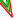
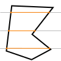

Generating Paths
====
One of the stages of slicing is to fill the areas, that were previously designated to a certain feature type, with lines that build the actual object. This stage could be considered the most complex. It's where CuraEngine uses most of its tricks. The devil is in the details. This page will highlight some of the major techniques involved.

Printing Order
----
The paths are generated in the same order in which they will be printed. This saves on memory and makes the architecture simpler. Therefore, before generating the paths the order must be determined. The order in which to print things is fairly rigid.

There is a precedence order for which things are considered more important to group together. This precedence goes as follows.

1. Each mesh group is printed in the sequence that they are sent to CuraEngine. A mesh group is a group of meshes that will get printed from bottom to top. Normally, your entire scene will consist of one mesh group, but if slicing via the command line or if the "One at a Time" mode is enabled in the front-end, you could have multiple mesh groups. The optimal sequence is determined by the front-end in order to minimise the collision area of each mesh group due to the shape of the print head when the nozzle needs to move back down towards the build plate for each mesh group.
2. The layers are printed in sequence from bottom to top.
3. Every extruder plan is printed in a certain order. The optimal order in which to print the extruders is determined beforehand in order to minimise the number of extruder switches. For example, if the printer has two extruders, then the first layer might start with the first extruder, then switch to the second extruder. The next layer must then start with the second extruder (so that there is no switch upon the layer transition) and switch to the first extruder. There will then be at most one extruder switch per layer.
4. Every mesh is printed separately. The order is determined in order to minimise travel moves and switches in configuration.
5. Every part of a mesh is printed separately. The order is determined in order to minimise travel moves again. The "parts" of a mesh are the disparate zones that originally came from the same 3D model file, but are in this layer separated by air.

Within a plan for an extruder on a layer, there is also a rigid order in which the features are printed. This order is as follows.

- Prime blob, if this is the first layer and a prime blob is requested.
- Prime tower, if the prime tower is enabled and there are any extruder switches in this layer or any higher layer.
- The skirt, brim or raft, whichever one is activated, if any, and if the bed adhesion is printing with this extruder.
- Ooze shield, if enabled and this is the first extruder on the layer.
- Draft shield, if enabled and this is the first extruder on the layer.
- Support, if enabled and set to print with this extruder.
- Each part is printed in order.
  - Infill.
  - Inner Walls.
  - Outer Wall.
  - Gaps in the walls are filled.
  - Skin.
  - Gaps in the skin are filled.
  - Ironing, if enabled.
  - Surface Mode, if set to "All" or "Surface".

Within a part there is a slight flexibility in the order due to the "Infill Before Walls" setting and the "Outer Before Inner Walls" setting.

Generating Walls
----
During the stage where the areas are generated for each feature type, one inset was already generated for every wall. These insets are going to become the centreline for each wall. Their vertex coordinates are eventually going to end up in the g-code as the destination coordinates of moves. Some work needs to be done to plan them properly though.

Each wall is given a certain line width, depending on the line width settings. The line segments for these walls are stored in an "Extruder Plan", an internal data structure. However the area that will get covered by these walls must also be calculated. In particular, the area that is _not_ covered by the walls must be calculated, because these are gaps that fall between the walls and must be filled with material later. In the image below, these gaps are indicated with a black outline.

Typically such gaps occur in very sharp corners. The nozzle is too fat to fit all the way into the corner without overextruding, so a gap will fall in the thinner part of the corner. Gaps can also occur in thin pieces where two walls are too close to each other to fill with another wall.

When generating a wall, CuraEngine also checks for overlap with previously printed walls. This includes the wall right before it, where there could be considerable overlap. The part of the new wall that overlaps with the previous wall will get its line width reduced such that the new area of that part of the line is only the part that is not covered by the other line.

Instead of actually reducing the flow rate of this thinner line segment, the speed of movement is increased. Typically a printer will have more short-term control over its velocity than its flow rate.

Infill Patterns
----
Infill patterns are used not only for generating infill, but also for generating support, skin and even ironing. They are CuraEngine's go-to method to fill an area with material. Here the task is to draw lines inside a certain shape to fill that shape with the desired material density.

The most basic infill pattern is lines infill. Most infill patterns are based on lines. Triangular infill, for instance, is just lines infill but repeated three times at 60 degree angles from each other. Even octet infill is based on lines, repeated twice vertically and twice horizontally, and then shifted with a certain offset as to create tetrahedra and octets.

For lines infill, the shape to fill is crossed with several scan lines at a certain distance from each other. This distance is computed such that the line width of this feature causes the desired infill density (e.g. 1 line width distance for 100% density, twice the line width for 50% density, and so on). Where the scan lines intersect the shape, the intersection point is computed and between every two scan lines, a line is generated. This is line infill.

Infill lines are optionally connected together. The algorithm to connect infill lines starts connecting two arbitrary adjacent lines. Then it follows the perimeter until it encounters the next crossing and connects that to the crossing after it, and so on until it's passed around the entire perimeter. It skips only the adjacent crossings if they are already part of the same polyline, so that no loops are created. This usually creates one single infill polyline, but this is not guaranteed; there are exceptional shapes that cannot be completely connected in this way.

